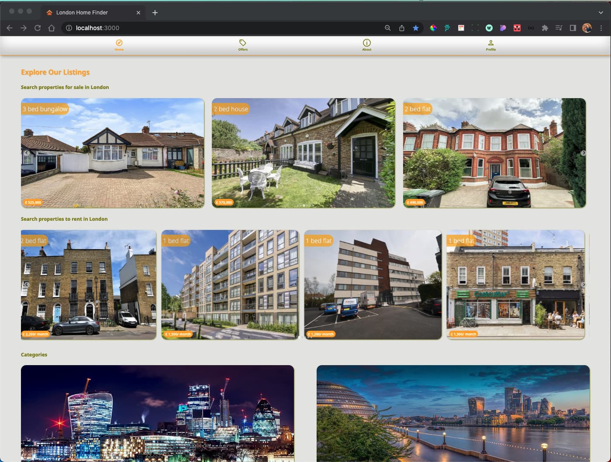
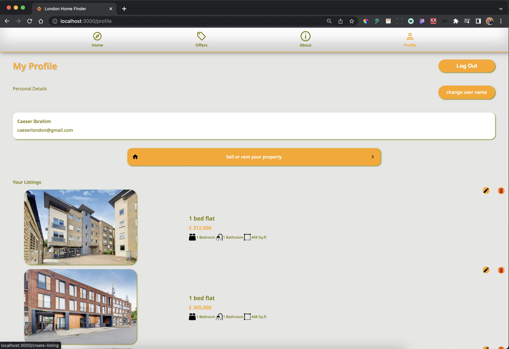
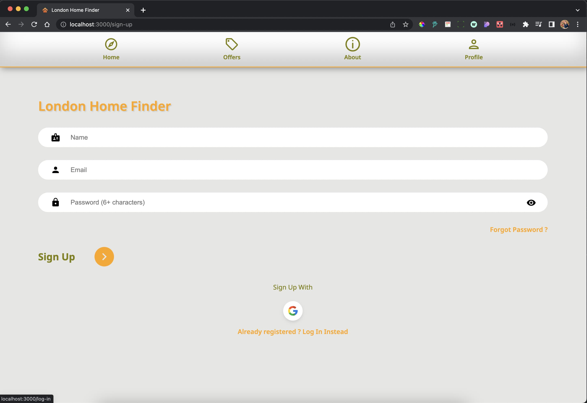

## London Home Finder Real Estate Application.

### For listings properties for rent and sale. using Firebase database to store data and images and using Google Auth for authentication.

#### Created using React V18.2.0 , react-router-dom V6.3.0 , react-leflet for maps , Firebase(Backend-as-a-Service (Baas)) and eact-toastify.

### Been deployed on Firebase at:

### https://caeser-london-home-finder.web.app/

##Developed using:

### React V18.2.0

https://reactjs.org/docs/getting-started.html

### React Router V6.3.0

https://reactrouter.com/docs/en/v6/getting-started/overview

### Firebase V9.8.3

https://firebase.google.com/docs/build
